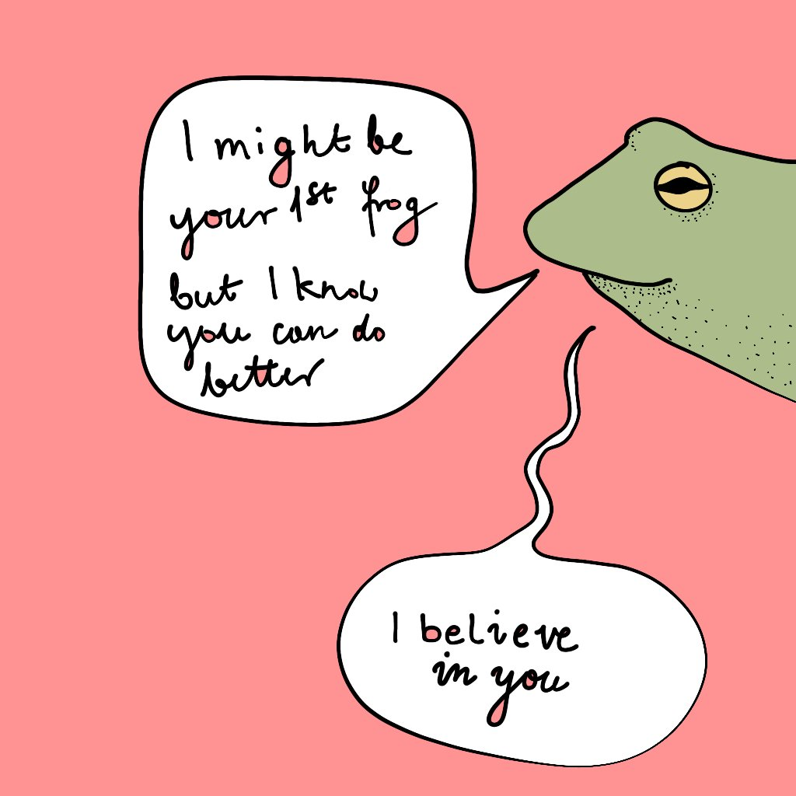

# 🐸

This repo contains the source code of [pep frog](https://amphibian.sonnet.io).

## I want to add my own pep talk!

Edit `src/data.ts` to modify the set of possible phrases or templates.
You don't need to install the project locally to do that, just fork the project and open the file on GH and hit <kbd>.</kbd>

### How does work

`src/collapse.ts` contains a simple text expansion engine. The syntax is similar to Tracery by [Kate Compton](https://github.com/galaxykate/tracery), but the implementation is much more limited (check `/src/collapse.spec.ts/` for examples of what's possible).

## Finally, remember the wise words of the amphibian oracle:

## Credits

-   the idea for this app comes from [this reddit post](https://i.redd.it/w6yzerz484u71.png)
-   the squiggly lines effect is based on [this CodePen](https://codepen.io/lbebber/pen/KwGEQv?editors=1100) by Lucas Bebber
-   the less cheesy, yet somewhat more funny phrases come from [Luna](https://www.instagram.com/luna.jenesaisquoi/).
